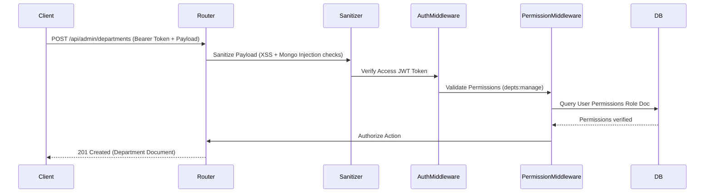

# System Architecture & Technical Specifications

This document outlines the codebase directories, database models, security controls, caching structures, and AI modules of CivicPulse.

---

## 📁 System Folder Structure

```
CivicPulseAI/
├── backend/
│   ├── src/
│   │   ├── config/             # Database connection, CORS configurations
│   │   ├── constants/          # Role configurations, permission mappings, error messages
│   │   ├── middleware/         # Auth verify, security input sanitizers, logging
│   │   ├── models/             # Mongoose schemas (User, Role, Complaint, Department, AuditLog, etc.)
│   │   ├── modules/            # Domain APIs (Auth, Citizen, Complaints, Admin, AI-Chat)
│   │   ├── repositories/       # Database access layers (User, Role, Complaint, Department)
│   │   ├── utils/              # JWT, password encryption, logger, in-memory caches
│   │   └── server.ts           # Express server entry point
│   ├── Dockerfile
│   └── tsconfig.json
├── frontend/
│   ├── src/
│   │   ├── app/
│   │   │   ├── core/           # Auth guards, API constant lists, API interceptors
│   │   │   ├── layouts/        # Layout shells (Main navigation sidebar, topbar)
│   │   │   ├── shared/         # Reusable SVG charts, modals, chatbot widget
│   │   │   └── features/       # Modules (Citizen Dashboard, Officer List, Admin pages)
│   │   ├── styles/             # Modular SCSS stylesheets (variables, mixins, global rules)
│   │   └── index.html
│   ├── Dockerfile
│   └── nginx.conf
└── docker-compose.yml
```

---

## 🗄️ Database Schemas & Relations

CivicPulse uses MongoDB with the following Mongoose schemas:

### 1. User (`User`)
- Stores user credentials, active roles (`citizen`, `officer`, `field_worker`, `admin`), profile details, and account locks (`isLocked`).

### 2. Role & Permissions (`Role`)
- Maps a system role document to an array of permission string tags (`users:view`, `depts:manage`). Populated via `database.config.ts` on server startup.

### 3. Complaint (`Complaint`)
- Records incidents with title, description, category (Road Damage, Water Supply, etc.), coordinates location, attachments, assigned department, status timeline, and AI analysis data.

### 4. Department (`Department`)
- Stores active municipal departments, assigned personnel arrays, and history logs of officer assignments.

### 5. Audit Log (`AuditLog`)
- Immutable trace records storing administrator actions (user locking, password resets, department creations) with client details.

### 6. Conversation (`Conversation`)
- Records AI assistant chatbot logs (user messages vs assistant replies) securely keyed by `userId` and user roles.

---

## 🔐 Security & Auth Flow



1. **Tokens**: Authentication uses double JWT tokens (Access token 15m expiration, Refresh token 7d rotation stored securely).
2. **Inputs Sanitization**: Global sanitizer checks request queries, parameters, and payloads to strip `$`/`.` keys (preventing MongoDB operator injection) and encodes HTML symbols (preventing XSS scripts execution).
3. **RBAC Rules**: Handled via custom express checkPermission tags compared against start-up seeded database role mappings.

---

## ⚡ Performance Caching

CivicPulse implements an in-memory cache system inside `cache.util.ts`:
* **Read-Through**: Frequently requested, slow-changing rosters (like the list of departments) check the cache map first. On cache-hit, records return immediately without querying MongoDB.
* **Write-Through Invalidation**: Any data alterations (creating departments, updating info, removing/assigning officers) trigger a cache invalidation for the corresponding key, maintaining database consistency.
