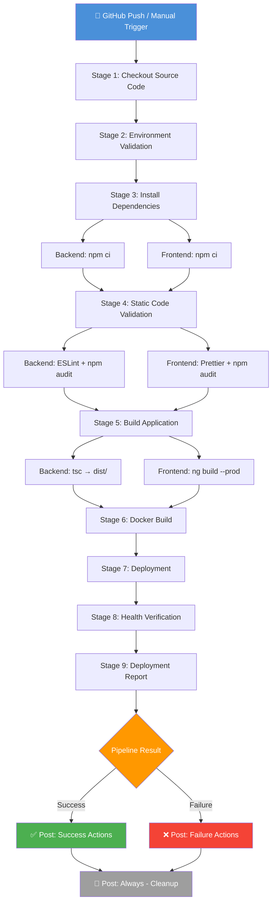
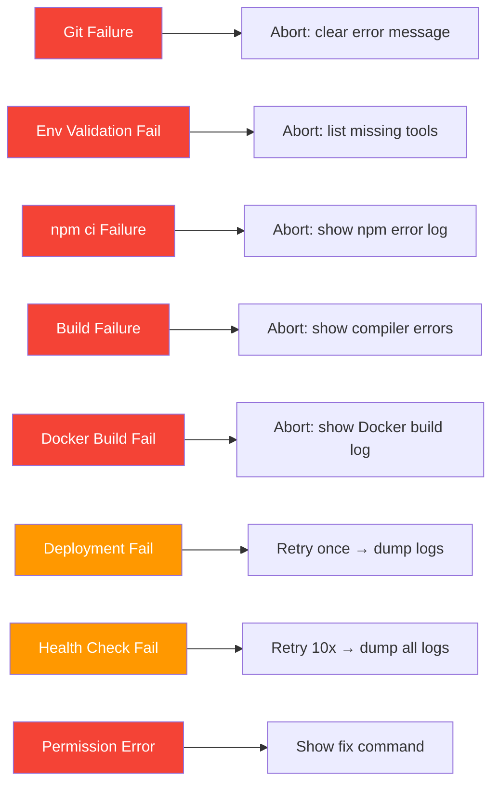

# Pipeline Architecture — CivicPulseAI

Technical documentation for the Jenkins CI/CD pipeline architecture, execution flow, and configuration reference.

---

## Pipeline Execution Flow



---

## Stage Details

### Stage 1 — Checkout Source Code
| Aspect     | Detail                                        |
|------------|-----------------------------------------------|
| **Tool**   | Git (via Jenkins SCM)                         |
| **Action** | Clean workspace → Clone repository            |
| **Output** | `GIT_COMMIT_SHORT`, `GIT_AUTHOR`, `GIT_BRANCH_NAME` |
| **Failure**| Abort pipeline immediately                    |

### Stage 2 — Environment Validation
| Check              | Required | Failure Behavior        |
|--------------------|----------|-------------------------|
| Docker             | ✅        | Abort pipeline          |
| Docker Compose     | ✅        | Abort pipeline          |
| Git                | ✅        | Abort pipeline          |
| Node.js + npm      | ✅        | Abort pipeline          |
| Project directories| ✅        | Abort pipeline          |
| `.env` files       | ⚠️        | Warning only            |
| Dockerfiles        | ✅        | Abort pipeline          |

### Stage 3 — Install Dependencies
| Component  | Command          | Notes                          |
|------------|------------------|--------------------------------|
| Backend    | `npm ci`         | Deterministic, lockfile-based  |
| Frontend   | `npm ci`         | Runs in parallel with backend  |

### Stage 4 — Static Code Validation
| Check          | Tool          | Fail Build? |
|----------------|---------------|-------------|
| npm audit      | npm           | ❌ Advisory  |
| Backend lint   | ESLint        | ⚠️ Warning   |
| Frontend format| Prettier      | ⚠️ Warning   |

> Skippable via `SKIP_TESTS` parameter.

### Stage 5 — Build Application
| Component  | Command                              | Output             |
|------------|--------------------------------------|--------------------|
| Backend    | `npm run build` (tsc)                | `backend/dist/`    |
| Frontend   | `ng build --configuration production`| `frontend/dist/`   |

Build artifacts are archived in Jenkins for historical access.

### Stage 6 — Docker Build
| Action                 | Command / Detail                              |
|------------------------|-----------------------------------------------|
| Prune dangling images  | `docker image prune -f`                       |
| Build images           | `docker compose build [--no-cache] --pull`    |
| Tag with build number  | `civicpulse/<service>:build-${BUILD_NUMBER}`  |

### Stage 7 — Deployment
| Step | Action                                    |
|------|-------------------------------------------|
| 1    | `docker compose down --remove-orphans`    |
| 2    | Remove exited containers                  |
| 3    | Prune unused networks                     |
| 4    | `docker compose up -d --build --force-recreate` |
| 5    | Verify all 4 containers are running       |

> Includes automatic retry on first failure.

### Stage 8 — Health Verification
| Check                  | Endpoint / Method              | Retries |
|------------------------|--------------------------------|---------|
| Backend API            | `GET /api/health` → HTTP 200   | 10      |
| Nginx                  | `GET /health` → HTTP 200       | 10      |
| Frontend               | `GET /` → HTTP 200             | 10      |
| Container health       | `docker inspect` health status | 10      |
| Port 80                | HTTP connection test           | 10      |
| Port 8000              | HTTP connection test           | 10      |
| Database               | Backend health → `database.status` | 10  |

### Stage 9 — Deployment Report
Generates and archives a comprehensive deployment report including:
- Build metadata (number, commit, branch, timestamp)
- Docker image inventory (tags, sizes)
- Container status table
- Service URLs
- Network and volume information
- Disk usage summary

---

## Pipeline Parameters

| Parameter        | Type     | Default       | Description                        |
|------------------|----------|---------------|------------------------------------|
| `BRANCH_NAME`    | String   | `main`        | Git branch to build                |
| `DEPLOY_ENV`     | Choice   | `development` | Target environment                 |
| `SKIP_TESTS`     | Boolean  | `false`       | Skip static code validation        |
| `DOCKER_PRUNE`   | Boolean  | `true`        | Prune dangling Docker resources    |
| `FORCE_REBUILD`  | Boolean  | `false`       | Force `--no-cache` Docker build    |

---

## Environment Variables

### Pipeline-Level (Jenkinsfile)

| Variable              | Value                | Purpose                      |
|-----------------------|----------------------|------------------------------|
| `PROJECT_NAME`        | CivicPulseAI         | Project identifier           |
| `COMPOSE_PROJECT_NAME`| civicpulse           | Docker Compose project name  |
| `DOCKER_IMAGE_PREFIX` | civicpulse           | Image naming prefix          |
| `APP_URL`             | http://localhost     | Application URL              |
| `BACKEND_URL`         | http://localhost:8000| Backend API URL              |
| `HEALTH_ENDPOINT`     | /api/health          | Backend health path          |
| `HEALTH_RETRIES`      | 10                   | Max health check retries     |
| `HEALTH_INTERVAL`     | 15                   | Seconds between retries      |
| `STARTUP_WAIT`        | 30                   | Initial wait before checks   |

### External Configuration
See `jenkins/config/pipeline.env` for the full configuration reference.

---

## Error Handling Strategy



Every failure produces:
1. **Descriptive error message** explaining what failed
2. **Context logs** (Docker logs, npm output, etc.)
3. **Post-failure cleanup** (always runs)

---

## File Structure

```
CivicPulseAI/
├── Jenkinsfile                          # Main pipeline definition
├── jenkins/
│   ├── scripts/
│   │   ├── deploy.sh                   # Deployment orchestration
│   │   ├── health-check.sh             # Health verification
│   │   ├── cleanup.sh                  # Post-build cleanup
│   │   └── generate-report.sh          # Report generator
│   ├── config/
│   │   └── pipeline.env                # Environment config
│   └── reports/                        # Generated reports (gitignored)
└── docs/
    ├── JENKINS_SETUP.md                # This setup guide
    ├── PIPELINE_ARCHITECTURE.md        # Architecture docs
    └── WEBHOOK_SETUP.md               # Webhook guide
```
