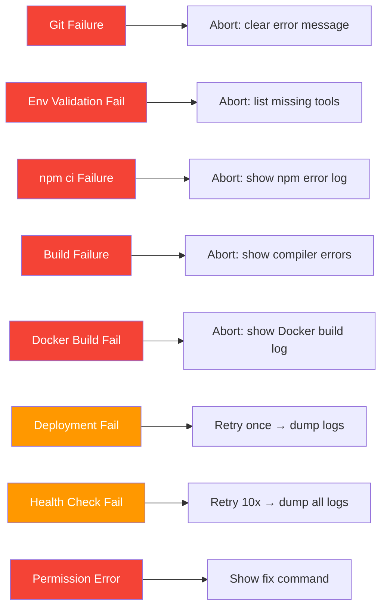

```mermaid
flowchart TD
    A["🔄 GitHub Push / Manual Trigger"] --> B["Stage 1: Checkout Source Code"]
    B --> C["Stage 2: Environment Validation"]
    C --> D["Stage 3: Install Dependencies"]
    D --> D1["Backend: npm ci"]
    D --> D2["Frontend: npm ci"]
    D1 --> E["Stage 4: Static Code Validation"]
    D2 --> E
    E --> E1["Backend: ESLint"]
    E --> E2["Frontend: Prettier Check"]
    E1 --> F["Stage 5: Build Application"]
    E2 --> F
    F --> F1["Backend: tsc → dist/"]
    F --> F2["Frontend: ng build --prod"]
    F1 --> U["Stage 5.5: Unit Tests & Code Coverage"]
    F2 --> U
    U --> G1["Stage 6: SonarQube Analysis"]
    G1 --> G2["Stage 7: SonarQube Quality Gate"]
    G2 -->|OK| T1["Stage 8: Trivy Filesystem Scan"]
    G2 -->|WARNING| T1
    T1 -->|OK| H["Stage 9: Docker Build"]
    T1 -->|FAILED| M["❌ Pipeline Aborted"]
    H --> T2["Stage 10: Trivy Image Scan"]
    T2 -->|OK| P1["Stage 10.5: Push Images to GHCR"]
    T2 -->|FAILED| M
    P1 --> I["Stage 11: Apply Argo CD Parameter Override (Zero-Commit)"]
    I --> V1["Stage 10.6: Pre-Deployment Image Verification"]
    V1 --> V2["Stage 10.7: Pre-Deployment Cluster Health Gate"]
    V2 --> J["Stage 12: Health Verification"]
    J --> MON1["Stage 12.5: Deploy & Verify Monitoring Stack"]
    MON1 --> MON2["Stage 12.6: Verify Prometheus Targets & Grafana"]
    MON2 --> ML1["Stage 12.7: Verify ML Decision Controller"]
    ML1 --> K1["Stage 13: Deployment Report"]
    K1 --> K2["Stage 13.5: Archive Monitoring Report"]
    K2 --> L{"Pipeline Result"}
    L -->|Success| M1["✅ Post: Success Actions"]
    L -->|Failure| M
    M1 --> N["🧹 Post: Always - Cleanup"]
    M --> N

    style A fill:#4A90D9,color:#fff
    style K1 fill:#FF9800,color:#fff
    style K2 fill:#FF9800,color:#fff
    style L fill:#4CAF50,color:#fff
    style M fill:#F44336,color:#fff
    style N fill:#9E9E9E,color:#fff
```

# Pipeline Architecture — CivicPulseAI

Technical documentation for the Jenkins CI/CD pipeline architecture, execution flow, and configuration reference.

---

## Pipeline Execution Flow

## Pipeline Execution Flow



---

## Stage Details

### Stage 1 — Checkout Source Code
| Aspect     | Detail                                        |
|------------|-----------------------------------------------|
| **Tool**   | Git (via Jenkins SCM)                         |
| **Action** | Clean workspace → Clone repository            |
| **Output** | `GIT_COMMIT_SHORT`, `GIT_AUTHOR`, `IMAGE_TAG` |
| **Failure**| Abort pipeline immediately                    |

### Stage 2 — Environment Validation
| Check              | Required | Failure Behavior        |
|--------------------|----------|-------------------------|
| Docker             | ✅        | Abort pipeline          |
| Docker Compose     | ✅        | Abort pipeline          |
| Git                | ✅        | Abort pipeline          |
| Node.js + npm      | ✅        | Abort pipeline          |
| Project directories| ✅        | Abort pipeline          |
| `.env` files       | ⚠️        | Warning / Auto-generate |
| Dockerfiles        | ✅        | Abort pipeline          |

### Stage 3 — Install Dependencies
| Component  | Command          | Notes                          |
|------------|------------------|--------------------------------|
| Backend    | `npm ci`         | Deterministic, lockfile-based  |
| Frontend   | `npm ci`         | Runs in parallel with backend  |

### Stage 4 — Static Code Validation
| Check          | Tool          | Fail Build? |
|----------------|---------------|-------------|
| Backend lint   | ESLint        | ⚠️ Warning   |
| Frontend format| Prettier      | ⚠️ Warning   |

> Skippable via `SKIP_TESTS` parameter.

### Stage 5 — Build Application
| Component  | Command                              | Output             |
|------------|--------------------------------------|--------------------|
| Backend    | `npm run build` (tsc)                | `backend/dist/`    |
| Frontend   | `ng build --configuration production`| `frontend/dist/`   |

Build artifacts are archived in Jenkins for historical access.

### Stage 5.5 — Unit Tests & Code Coverage
| Component  | Test Framework | Strategy / DB | Coverage Output |
|------------|----------------|---------------|-----------------|
| Backend    | Jest           | Ephemeral MongoDB container (`civicpulse-ci-mongodb:27017`) | `backend/coverage/lcov.info` |
| Frontend   | Vitest         | Standalone component testing | `frontend/coverage/lcov.info` |

> Enforces lcov report presence; fails pipeline if reports are missing.

### Stage 6 — SonarQube Analysis
| Parameter / Tool       | Configuration / Detail                                   |
|------------------------|----------------------------------------------------------|
| Scanner Execution      | `withSonarQubeEnv('SonarQube')`                          |
| Auto-Detection         | Dynamic `src` folder discovery (`backend/src`, `frontend/src`) |
| Exclusions             | `node_modules`, `dist`, `coverage`, `logs`, Docker files |

### Stage 7 — SonarQube Quality Gate
| Parameter / Tool       | Configuration / Detail                                   |
|------------------------|----------------------------------------------------------|
| Quality Gate Wait      | `waitForQualityGate()`                                   |
| Soft Gate Policy       | Non-blocking soft warning on failure to support offline dev |

### Stage 8 — Trivy Filesystem Scan
| Action                 | Detail                                                   |
|------------------------|----------------------------------------------------------|
| Target                 | Repository filesystem (`.`)                              |
| Severity Levels        | `HIGH,CRITICAL` (`--ignore-unfixed`)                     |
| Reports Generated      | HTML, JSON, SARIF (`jenkins/reports/trivy/trivy-fs-*`)   |
| Quality Gate           | `--exit-code 1` (Aborts pipeline before Docker build)   |

### Stage 9 — Docker Build
| Action                 | Command / Detail                              |
|------------------------|-----------------------------------------------|
| Prune dangling images  | `docker image prune -f`                       |
| Build images           | `docker compose build [--no-cache] --parallel`|
| Build Tags             | `civicpulse/*:${BUILD_NUMBER}`                |

### Stage 10 — Trivy Image Scan
| Action                 | Detail                                                   |
|------------------------|----------------------------------------------------------|
| Targets Scanned        | `civicpulse/backend`, `frontend`, `nginx`, `mongodb`, `ml-decision-controller` |
| Security Quality Gate  | `--exit-code 1` (Aborts deployment on HIGH/CRITICAL)    |
| Reports Generated      | HTML, JSON vulnerability audit reports                    |

### Stage 10.5 — Push Images to GHCR
| Action                 | Detail                                                   |
|------------------------|----------------------------------------------------------|
| GHCR Push              | Authenticated push to `ghcr.io/tharunadhithyaa/civicpulse-*:${BUILD_NUMBER}` |
| Retry Mechanism        | Multi-attempt push with exponential backoff (`push_with_retry`) |

### Stage 11 — Apply Argo CD Parameter Override (Zero-Commit Design)
| Step | Action                                    |
|------|-------------------------------------------|
| 1    | Execute `jenkins/scripts/update-gitops.sh --build-number ${BUILD_NUMBER}` |
| 2    | Patch live parameter overrides (`backend.image.tag`, `frontend.image.tag`) directly on Argo CD Application Custom Resource in K3s |
| 3    | Zero-Commit design avoids git commits, preventing build loops and commit churn |
| 4    | Trigger Argo CD sync & wait for K3s workload rollout completion |

### Stage 10.6 — Pre-Deployment Image Verification
| Action                 | Detail                                                   |
|------------------------|----------------------------------------------------------|
| Manifest Check         | Queries GHCR API (`v2/.../manifests/...`) or `docker manifest inspect` |
| Verification Gate      | Fails early if image tags are missing from GHCR registry |

### Stage 10.7 — Pre-Deployment Cluster Health Gate
| Action                 | Detail                                                   |
|------------------------|----------------------------------------------------------|
| Cluster Health         | Runs `./jenkins/scripts/pre-deploy-self-heal.sh --mode pre` |

### Stage 12 — Health Verification & Post-Deployment Gate
| Check                  | Endpoint / Method              | Retries |
|------------------------|--------------------------------|---------|
| NodePort Ingress       | `http://<K3S_NODE_IP>:30080/`  | 10      |
| Backend API            | `GET /api/health` → HTTP 200   | 10      |
| Nginx Proxy            | `GET /health` → HTTP 200       | 10      |
| Container health       | `health-check.sh` probe checks | 10      |

### Stage 12.5 — Deploy & Verify Monitoring Stack
| Check                  | Method / Endpoint              | Purpose |
|------------------------|--------------------------------|---------|
| Monitoring Script      | `jenkins/scripts/verify-monitoring.sh` | Audits Prometheus, Grafana, Alertmanager |

### Stage 12.6 — Verify Prometheus Targets & Grafana
| Check                  | Method / Endpoint              | Purpose |
|------------------------|--------------------------------|---------|
| Grafana Dashboard UI   | `GET http://<K3S_NODE_IP>:30080/grafana/` | Validates dashboard accessibility |

### Stage 12.7 — Verify ML Decision Controller
| Check                  | Method / Endpoint              | Purpose |
|------------------------|--------------------------------|---------|
| Controller Probe       | `GET http://localhost:5000/health` | Validates ML Controller health probe |
| Self-Healing Suite     | `jenkins/scripts/verify-self-healing.sh` | Runs remediation verification suite |

### Stage 13 — Deployment Report
Generates and archives comprehensive deployment reports including build metadata, container inventory, GHCR tags, and service URLs.

### Stage 13.5 — Archive Monitoring Report
Archives detailed monitoring stack audit reports (`jenkins/reports/monitoring/**/*`).

---

## Pipeline Parameters

| Parameter        | Type     | Default       | Description                        |
|------------------|----------|---------------|------------------------------------|
| `BRANCH_NAME`    | String   | `main`        | Git branch to build                |
| `DEPLOY_ENV`     | Choice   | `development` | Target environment                 |
| `SKIP_TESTS`     | Boolean  | `false`       | Skip static code validation        |
| `DOCKER_PRUNE`   | Boolean  | `true`        | Prune dangling Docker resources    |
| `FORCE_REBUILD`  | Boolean  | `true`        | Force `--no-cache` Docker build    |

---

## Environment Variables

### Pipeline-Level (Jenkinsfile)

| Variable              | Value                | Purpose                      |
|-----------------------|----------------------|------------------------------|
| `PROJECT_NAME`        | CivicPulseAI         | Project identifier           |
| `COMPOSE_PROJECT_NAME`| civicpulse           | Docker Compose project name  |
| `DOCKER_IMAGE_PREFIX` | civicpulse           | Image naming prefix          |
| `APP_URL`             | http://<K3S_NODE_IP>:30080/| Application URL (NodePort)  |
| `BACKEND_URL`         | http://localhost:8000| Backend API URL              |
| `HEALTH_ENDPOINT`     | /api/health          | Backend health path          |
| `HEALTH_RETRIES`      | 10                   | Max health check retries     |
| `HEALTH_INTERVAL`     | 15                   | Seconds between retries      |
| `STARTUP_WAIT`        | 30                   | Initial wait before checks   |

### External Configuration
See `jenkins/config/pipeline.env` for the full configuration reference.

---

## Error Handling Strategy



Every failure produces:
1. **Descriptive error message** explaining what failed
2. **Context logs** (Docker logs, npm output, etc.)
3. **Post-failure cleanup** (always runs)

---

## File Structure

```
intelligent-self-healing-cicd/
├── Jenkinsfile                          # Main declarative pipeline definition (13 stages)
├── jenkins/
│   ├── scripts/
│   │   ├── deploy.sh                   # Deployment orchestration
│   │   ├── health-check.sh             # Health verification
│   │   ├── cleanup.sh                  # Post-build cleanup
│   │   ├── generate-env.sh             # Environment generator
│   │   └── generate-report.sh          # Report generator
│   ├── config/
│   │   └── pipeline.env                # Environment config
│   └── reports/                        # Generated reports (gitignored)
└── docs/
    ├── API_DOCUMENTATION.md            # REST API specification
    ├── ARCHITECTURE.md                 # System architecture manual
    ├── JENKINS_SETUP.md                # Jenkins setup guide
    ├── PIPELINE_ARCHITECTURE.md        # Pipeline architecture docs
    └── POLL_SCM_SETUP.md               # Poll SCM trigger guide
```

